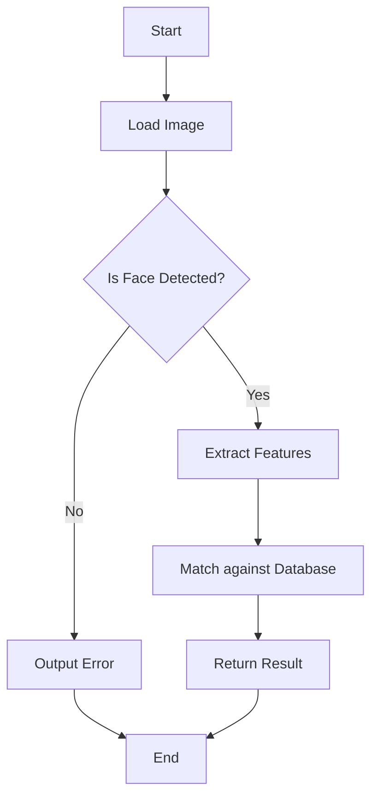

# Face Recognition with ArcFace and RetinaFace

## Overview
This project combines the capabilities of the ArcFace and RetinaFace algorithms for robust face recognition. The following sections provide a detailed understanding of the algorithms, architecture, requirements, and performance metrics of the system.

## ASCII Art Diagrams
```
    +------------+    +-----------------+
    |  Input     |    | Face Detection  |
    |  Image     | --> | (RetinaFace)    |
    +------------+    +-----------------+
            |                 |
            |                 |
    +------------+    +-----------------+
    |  Pre-     |    |  Feature        |
    |  Processing|    |  Extraction     |
    +------------+    |  (ArcFace)      |
            |        +-----------------+
            |                 |
    +------------+    +-----------------+
    | Output     |    | Recognition     |
    |  Results   | <-- |  (Similarity    |
    +------------+    |   Matching)     |
                      +-----------------+
```

## Detailed Algorithm Explanations
- **ArcFace:** A deep learning algorithm for face recognition that learns discriminative features of faces using an additive angular margin loss.

- **RetinaFace:** A dense face detector that can precisely locate and classify faces in images using a single-stage architecture. It employs the Focal Loss function to effectively address the class imbalance in datasets.

## Architecture Flowcharts


## Requirements
- Python 3.x
- TensorFlow or PyTorch
- OpenCV
- Numpy
- Scipy

## Performance Metrics
- **Accuracy:** The fraction of correctly predicted faces.
- **Precision:** The ratio of true positive predictions to the total predicted positives.
- **Recall:** The ratio of true positive predictions to the actual positives.
- **F1 Score:** The harmonic mean of precision and recall.

## Comprehensive Documentation
This project is thoroughly documented, providing insights into implementation and usage. For detailed instructions and further explanations, please refer to the [Wiki](https://github.com/HilkirySG/FaceRecognition_ArcFace-RetinaFace/wiki).

---  

For contributions and discussions, please open issues or pull requests!  

Happy coding!